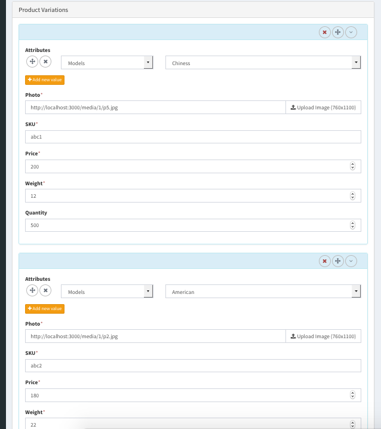

## Installation
* Add in your Gemfile

```
* In your console
```
bundle install
rails s
```
* Navigate and activate the plugin in http://localhost:3000/admin -> plugins -> ecommerce
* Configure your store
  - Payment Methods
  - Shipping Methods
  - Product Attributes
  - Tax Rates
  - Create Products, Categories
  - Site menus
* Start Selling on http://localhost:3000

## Features
* Easy frontend customization by camaleon-cms themes
* Multi language support
* Multi site support
* Shipping to specific countries
* Multiple currencies conversions for visitors
* Invoices
* Visual customization of email templates
* Multiple Product Variations
* Categories and Tags
* Easy extensible by visual custom fields editor
* Default payments support: Stripe, Bank transfer, On delivery, Paypal, Authorize.net and for custom payment methods:

  

## Contributing
* Fork it.
* Create a branch (git checkout -b my_feature_branch)
* Commit your changes (git commit -am "Added a sweet feature")
* Push to the branch (git push origin my_feature_branch)
* Create a pull request from your branch into master (Please be sure to provide enough detail for us to cipher what this change is doing)
# ycommerce
